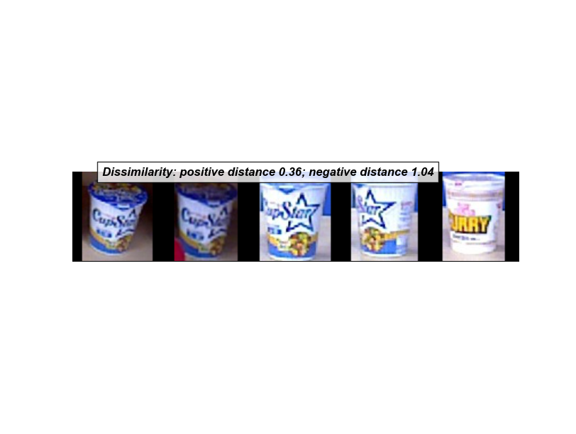

## Learning Object Similarity with multi-view Triplet Network
## Test code
 - Download trained models from the url in models directory
 - `python scripts/test_network.py`
 - If you want to see the visualization run `python scripts/test_network.py --visualization=True`
  

   
  
